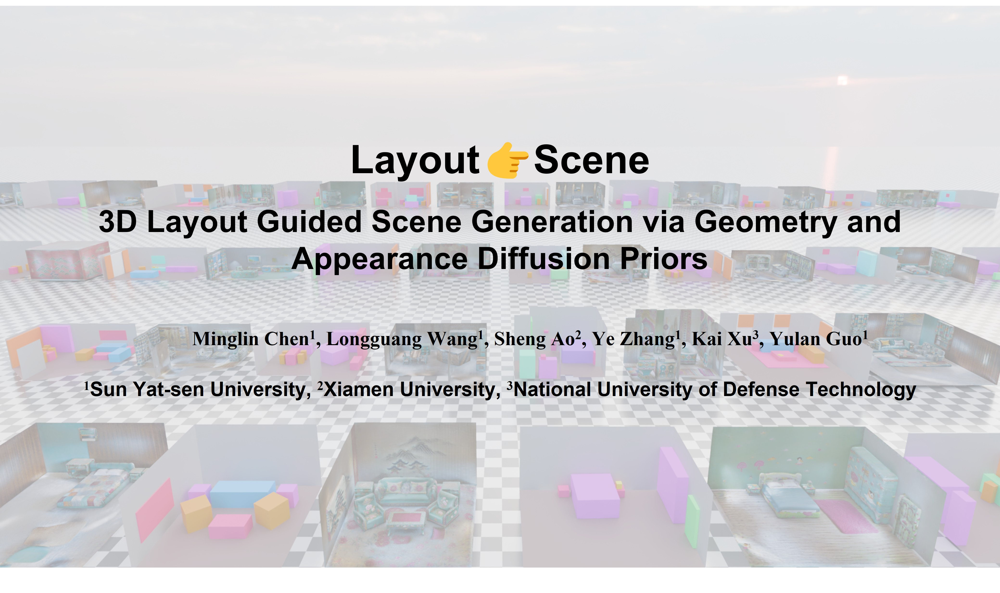

# Layout2Scene

[[Project Page](https://minglin-chen.github.io/Layout2Scene/index.html)] [[Models](https://huggingface.co/mlchen/Layout2Scene/tree/main)]


TL;DR: Layout2Scene is a layout-based indoor scene generation framework that generates 3D scene from human-provided layout and text prompts.



Key Features:
- Generate 3D scenes from JSON format layout files
- Support multiple indoor scene types (bedroom, living room, etc.)
- Customizable scene style and appearance
- Geometry reconstruction based on multi-view rendering
- Texture generation and mesh refinement


## ⚙️ Installation

### Clone Repository

```bash
git clone --recurse-submodules git@github.com:Minglin-Chen/Layout2Scene.git
cd Layout2Scene
```

### Environment Setup

```bash
conda create -n layout2scene python==3.11
conda activate layout2scene

# Install PyTorch (CUDA 11.8)
pip install torch torchvision torchaudio --index-url https://download.pytorch.org/whl/cu118
pip install xformers --index-url https://download.pytorch.org/whl/cu118

# Install dependencies
pip install -r requirements.txt
```

### 📦 Pre-trained Weights Download

The project requires downloading the pre-trained weights from [link](https://huggingface.co/mlchen/Layout2Scene/tree/main), then put it into folder `checkpoint`:

## 🚀 Usage

### Scene Generation

Basic usage:

```bash
python layout2scene.py \
    --layout data/layout/hypersim_ai_010_005/layout.json \
    --type bedroom \
    --style "Bohemian style" \
    --output outputs \
    --gpu 0,1,2,3,4,5,6,7
```

Parameter description:
- `--layout`: Path to layout JSON file
- `--type`: Scene type (bedroom, livingroom, etc.)
- `--style`: Scene style description
- `--camera`: Path to camera parameters JSON file (optional, will be generated automatically)
- `--output`: Output directory
- `--gpu`: GPU device IDs, separated by commas

### 🏗️ Layout Design

Layout files are in JSON format and contain bounding box (bbox) information for objects in the scene:

```json
{
  "bbox": [
    {
      "class": "bed",
      "prompt": "bed",
      "location": [x, y, z],
      "size": [width, height, depth],
      "rotation": [euler_x, euler_y, euler_z]
    }
  ],
  "background": {
    "vertices": [[x1,y1,z1],[x2,y2,z2],...],
    "faces": {
        "ceiling": [[f1,f2,f3],...],
        "floor": [...],
        "walls": [...],
    }
  }
}
```

The project provides some example layout files in the `data/layout/` directory.

The layout can be easily designed in Blender with our addon [[link](https://github.com/Minglin-Chen/BlenderGen3D#)], and then export the layout files. An example video is as follows:

[](https://www.youtube.com/watch?v=[YOUR_VIDEO_ID](https://youtu.be/e2DD_puG01M))

### 📷 Camera Sampling

If no camera file is provided, the system will automatically perform layout-aware camera sampling:

```bash
python -m layout_aware_camera_sampling --layout_path path/to/layout.json --output_path path/to/cameras.json
```

## 🙏 Acknowledgments

This project is based on the following open-source projects and research:

- [ThreeStudio](https://github.com/threestudio-project/threestudio)
- [Gaussian Splatting](https://github.com/graphdeco-inria/gaussian-splatting)
- [ControlNet](https://github.com/lllyasviel/ControlNet)
- [Diffusers](https://github.com/huggingface/diffusers)

Thanks to all contributors and the open-source community for their support.

## 📚 Citations

If you use this project in your research, please cite the following paper:

```bibtex
@article{chen2024layout2scene,
  @article{chen2025layout2scene,
  title={Layout2Scene: 3D semantic layout guided scene generation via geometry and appearance diffusion priors},
  author={Chen, Minglin and Wang, Longguang and Ao, Sheng and Zhang, Ye and Xu, Kai and Guo, Yulan},
  journal={arXiv preprint arXiv:2501.02519},
  year={2025}
}
}
```

## 📄 License

This project is licensed under the MIT License.